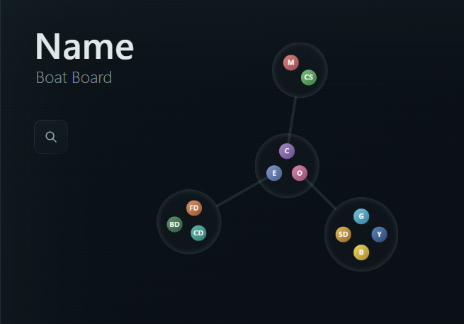

# BoatBoard

BoatBoard is a local-first visual company directory. Teams appear as bubbles and colleagues as profile circles. The eventual viewer is intended for private company hosting; real company data is not part of this repository.



## Current Application

The dependency-free application uses HTML, CSS, JavaScript modules, Canvas, and a small Python local file server. The read-only viewer supports smooth cursor-centered zoom, unrestricted drag-to-pan, search, and anchored colleague/team details. The editor reuses the complete viewer and adds a toggleable authoring mode for instance data, team placement, leadership connections, profile ordering, and arrangement rotation.

Run from the repository root:

```powershell
python -m pip install -r requirements.txt
python scripts/boatboard_server.py
```

Open `http://127.0.0.1:4173/` for the viewer or `http://127.0.0.1:4173/editor.html` for local authoring.

## Data And Privacy

The tracked `project/instance_template/` is a clean, empty seed. On first server start it creates the ignored `project/private_instance/`, containing `boatboard.xlsx`, an `images/` folder, and `board.json`. This directory is the complete local company instance; keep its private records and images out of Git.

For the current MVP, open the editor and create teams and colleagues manually. Changes to organization data and board layout autosave locally. Image filenames, descriptions, and contact fields remain available in the workbook data model, but they are optional and do not need to be populated during basic local setup. Bulk setup can use a compatible workbook plus images whose filenames match colleague rows.

## Repository Frame

```text
BoatBoard/
  project/        application source and reusable instance template
  asset_staging/  Git-safe raw/reference assets
  local_assets/   ignored machine-local material
  docs/           durable project and AI memory
  notes/          owner scratch space
  scripts/        local server and future repeatable automation
```

## Standalone Local Preview

Generate the clean Windows MVP folder with:

```powershell
powershell -NoProfile -ExecutionPolicy Bypass -File scripts\Export-LocalRelease.ps1
```

The ignored output is `exports/BoatBoard-local/`. It contains a self-contained `BoatBoard.exe`, editor launcher, stop control, application files, and an empty first-run seed. End users do not need Python. The build command prepares an ignored PyInstaller environment automatically when a suitable development Python is available.

## AI Workflow

- `memcheck`: update durable project memory without committing.
- `gitcheck`: perform `memcheck`, review and validate changes, verify Git identity, commit, and push when a remote exists.

`localrelease` is an unversioned local MVP preview only. No installer, GitHub Release, hosted deployment, authentication, or production data integration is established yet.
